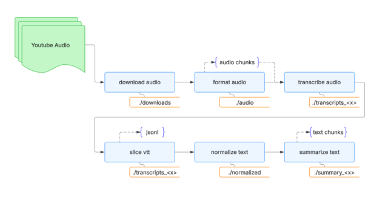

# YATSEE Audio Pipeline Overview

A modular pipeline for extracting, enriching, and summarizing civic meeting audio data.

## Process Flow



**Pipeline Flow (Top-Level)**  
`downloads/` → `audio/` → `transcripts_<model>/` → `normalized/` → `summary/` → `yatsee_db/`

---

## Pipeline Flow Overview
1. `downloads/` → raw video/audio  
2. `audio/` → converted `.wav` or `.flac`  
3. `transcripts_<model>/` → `.vtt` + flat `.txt`  
4. `normalized/` → cleaned, structured `.txt`  
5. `summary/` → `.md` or `.yaml` summaries

YATSEE is designed as a collection of independent tools. While they work best as a unified pipeline, each script can be run standalone as long as the input data matches the Interface Contract.

### 1. Automated Download
- **Script:** `yatsee_download_audio.py`
- **Input:** YouTube URL (bestaudio)
- **Output:** `.mp4` or `.webm` to `downloads/`
- **Tool:** `yt-dlp`
  - **Purpose:** Archive livestream audio for local processing 

### 2. Convert Audio
- **Script:** `yatsee_format_audio.py`
- **Input:** `.mp4` or `.webm` from `downloads/`
- **Output:** `.wav` or `.flac` to `audio/`
- **Tool:** `ffmpeg`
- **Format Settings:**
  - WAV: `-ar 16000 -ac 1 -sample_fmt s16 -c:a pcm_s16le`
  - FLAC `-ar 16000 -ac 1 -sample_fmt s16 -c:a flac`
- **Notes:**
  - Supports **chunked output** for long audio
  - Optional overlap between chunks to prevent cutting phrases

### 3. Transcribe Audio
- **Script:** `yatsee_transcribe_audio.py`
- **Input:** `.flac` from `audio/`
- **Output:** `.vtt` to `transcripts_<model>/`
- **Tool:** `whisper` or `faster-whisper`
- **Notes:**
  - Supports **stitching chunked audio** back into a single transcript
  - Accepts model selection: `small`, `medium`, `large`, etc.
  - Faster-whisper improves performance if installed

### 4. Clean and Normalize
#### a. Strip Timestamps
- **Script:** `yatsee_slice_vtt.py`
- **Input:** `.vtt` from `transcripts_<model>/`
- **Output:** `.txt` (timestamp-free) to same folder

#### b. JSONL Segmentation and Text Compression
- **Script:** `yatsee_slice_vtt.py`
- **Input:** `.vtt` from `transcripts_<model>/`
- **Output:** `.jsonl` to same folder
  - **Purpose:** JSONL segments (sliced transcript for embeddings/search).

#### c. Text Normalization
- **Script:** `yatsee_normalize_structure.py`
- **Input:** `.txt` from `normalized/`
- **Output:** `.txt` to `normalized/`
- **Tool:** `spaCy`
  - **Purpose:** Segment text into readable sentences and normalize punctuation/spacing.

### 5. Summarize Transcripts using AI (Local LLM)
- **Script:** `yatsee_summarize_transcripts.py`
- **Input:** `.txt` from `normalized/`
- **Output:** `.md` or `.yaml` to `summary/`
- **Tool:** `ollama`
- **Notes:**
  - Supports short and long-form summaries
  - Optional YAML output (e.g., vote logs, action items, discussion summaries)
  - Advanced chunking supports: density-aware, sentence-aligned, and word-based chunk boundry strategies.

All scripts are modular and can be run independently or as part of an automated workflow.

### Index and Search _(In Development)_
#### Index Data
- **Script:** `yatsee_index_data.py`
- **Input:** `.txt` from `normalized/`
- **Input:** `.md` from `summary/`
- **Output:** `embeddings` to `yatsee_db/`
- **Tool:** `ChromaDB`
- **Notes:**
  - Generate embeddings from raw transcripts and summaries into a searchable civic intelligence database.
  - **Vector Search (Semantic):** Uses ChromaDB with the `BAAI/bge-small-en-v1.5` model to allow for fuzzy, concept-based queries (e.g., "Find discussions about road repairs").

#### Search _(In Development)_
- **Script:** `yatsee_index_data.py`
- **Input:** `.txt` from `normalized/`
- **Input:** `.md` from `summary/`
- **Input:** `embeddings` from `yatsee_db/`
- **Tool:** `Streamlit and ChromaDB`
- **Notes:**
  - **UI:** A simple web interface built with Streamlit to provide an overview of the generated transcripts and summaries.
  - Planned **Graph Search (Relational):** Extract structured data (Votes, Contracts, Appointments) into a knowledge graph to trace connections between people and money.

---

## 📁 Filesystem Layout
```
data/
└── <entity_handle>/
    ├── downloads/                ← Raw input (audio/video)
    ├── audio/                    ← Converted 16kHz mono files
    ├── transcripts_<model>/      ← VTTs + initial flat .txt files
    ├── normalized/               ← Cleaned + structured output (spaCy)
    ├── summary/                  ← Generated meeting summaries (.md/.yaml)
    ├── yatsee_db/                ← Vector database files (ChromaDB)
    ├── prompts/                  ← Optional default prompt overrides(created by user)
    └── conf.toml                 ← Localized entity config
```

---

## Config file routing/load order
```
Global TOML
    |
    +--> Entity handle
            |
            +--> Local config (hotwords, divisions, data_path)
                    |
                    +--> Pipeline stage (downloads, audio, transcripts)
```

---

## Prompt override layout example:
```
./prompts/                      # default prompts for all entities
  └── research/
      └── prompts.toml          # default prompts & routing for 'research' job type

./data/
  └── defined_entity/           # entity-specific data
      └── prompts/
          └── research/
              └── prompts.toml  # full override for defined_entity 'research' job type

./data/
  └── generic_entity/           # another entity with no override
      └── prompts/
          └── research/
              # no file, falls back to default in prompts/research/prompts.toml

**Behavior**:

  - Loader first checks `data/<entity>/prompts/<job_type>/prompts.toml`.  
  - If found → full override of defaults.  
  - If not found → fall back to `prompts/<job_type>/prompts.toml`.
```

---

## 🚀 Running the Pipeline

Run each script in sequence or independently as needed:
All scripts accept the -e (entity) flag to route data to the correct folders defined in yatsee.toml.

### 📄 Script Summary

| Script                                                | Purpose                                         |
|-------------------------------------------------------|-------------------------------------------------|
| `python3 yatsee_sound_recorder.py`                    | Real-time, audio capture for in-person meetings |
| `python3 yatsee_download_audio.py -e <entity>`        | Download audio from YouTube URLs                |
| `python3 yatsee_format_audio.py -e <entity>`          | Convert downloaded files to `.flac` or `.wav`   |
| `python3 yatsee_transcribe_audio.py -e <entity>`      | Transcribe audio files to `.vtt`                |
| `python3 yatsee_slice_vtt.py -e <entity>`             | Slice and segment `.vtt` files                  |
| `python3 yatsee_normalize_structure.py -e <entity>`   | Clean and normalize text structure              |
| `python3 yatsee_summarize_transcripts.py -e <entity>` | Generate summaries from cleaned transcripts     |
| `python3 yatsee_index_data.py -e <entity>`            | Vectorize and index embeddings                  |
| `streamlit run yatsee_search_demo.py -- -e <entity>`  | Search summaries and transcripts                |
